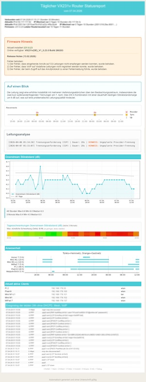

# TP-Link Status Report


 
### [TP-Link Daily Report](docu/statusreport_doku.md)
Ein Python-Skript (`tp-report.py`) zur automatisierten Erfassung der DSL, Client und Logdaten des Routers.<br>
Optionale Erstellung und Versand eines täglichen Statusreports per E-Mail.




**Funktionen:**
* Datenabruf von DSL-Werten und der verbundenen Clients via [Router API von Alexandr Erohin ](https://github.com/AlexandrErohin/TP-Link-Archer-C6U)
* Speicherung der Daten in einer Datenbank
* Automatisierte Generierung und Versand von täglichen Statusreports
<details>
<summary><i>Vollständigen Beispielreport anzeigen</i></summary>


</details>
* Die Reportsprache kann zwischen Deutsch und Englisch umgeschaltet werden
* mehr zu den Einzelbestandteilen des Reports siehe<br>
[Details zum Statusreport](docu/statusreport_doku.md)
<br>

**Einfache Installation:**
```bash
curl -sL https://raw.githubusercontent.com/einstweilen/tp-link-daily-report/main/install_report.sh | bash
```
<br>

<details>
<summary>Beispielablauf der Schnellen Installation</summary>

```
curl -sL https://raw.githubusercontent.com/einstweilen/tp-link-daily-report/main/install_report.sh | bash
==== tp-report Installation ====
  ℹ Erstelle Verzeichnis tp-report...
  ℹ Ermittle Dateiliste von GitHub...
  ℹ Lade README.md herunter...
  ℹ Lade config-report.ini.sample herunter...
  ℹ Lade install_report.sh herunter...
  ℹ Lade requirements.txt herunter...
  ℹ Lade setup_ai_key.sh herunter...
  ℹ Lade tp-report-setup-guide.md herunter...
  ℹ Lade tp-report.py herunter...

==> [1/7] Erstelle virtuelle Umgebung...
  ℹ Aktiviere virtuelle Umgebung...
  ✓ Virtuelle Umgebung bereit.

==> [2/7] Installiere Abhängigkeiten...
  ℹ pip install (Details: .install_report.log)...
  ✓ Abhängigkeiten installiert.

==> [3/7] Überprüfe Konfigurationsdatei...
  ✓ config-report.ini wurde aus der Vorlage erstellt.

==> [4/7] Interaktive Router-Konfiguration
  ? Wie lautet die IP-Adresse des Routers? [192.168.1.1]: 192.168.178.1
  ? Bitte das Passwort für das Web-Interface (GUI) eingeben: 
  ℹ Trage Daten in config-report.ini ein...
  ℹ Teste Login mit den angegebenen Daten...
  ✓ Login am Router erfolgreich!

==> [5/7] KI Analyse Einrichtung
  ? KI Datenanalyse im Report verwenden? (Gemini API Key benötigt) [J/N]: j

==== KI-Analyse Einrichtung (Daily Report) ====
  [V] Ein Google Gemini API Key ist bereits vorhanden
  [G] Einen kostenlosen Google Gemini Key generieren

  [N] Nein, keine KI Analyse der Routerdaten durchführen

  ? Bitte Option wählen (V/G/N): v

  ℹ Feld leerlassen um keinen Key zu hinterlegen.
  ? Bitte den API Key einfügen: AIzaDerGoogleGemini-APIkey

  ℹ Teste Google Gemini API Key...
  ✓ API Key erfolgreich validiert!
  ℹ Speichere API-Key in config-report.ini...
  ✓ KI-Setup vollständig abgeschlossen.

==> [6/7] Cronjobs einrichten
  ? Automatischen Jobs für Update & Report in die crontab eintragen? (J/N): n
  ℹ Übersprungen.

==> [7/7] Installation testen...
  ℹ Führe Test-Update aus...
API Login OK. Hole Daten...
428 Events gespeichert.
Update abgeschlossen.

==== Installation abgeschlossen! ====

  ℹ Bitte die E-Mail Einstellungen in config-report.ini anpassen,
  ℹ damit der Bericht versendet werden kann.

```
</details>


[Die einzelnen Module des Statusreports im Detail](docu/statusreport_doku.md)


---

Als funktionale Erweiterung des TP-Link Reports kann der [VX-Info Tracker](https://github.com/einstweilen/tp-link-vx231v/blob/main/vx-info.md) betrachtet werden. Beide, Report und Tracker, nutzen die gleiche Datenstruktur, ein Wechsel ist jederzeit möglich, bereits erfaßte Daten lassen sich in beide Richtungen weiter verwenden.<br>
Der VX-Info Tracker unterstützt zusätzlich zur Datenerfassung über die Third-Party-API auch die Erfassung per Scraping der Routeroberfläche und optional - bei aktivierten Superadmin-Account - auch per SNMP/Telnet und nutzt automatisch immer die schnellste verfügbare Methode.

---

### Getestet unter MacOS und Debian/DietPi mit einem TP-Link VX231v, andere TP-Link Router können abweichen