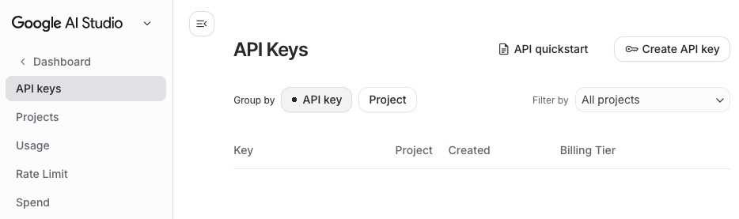
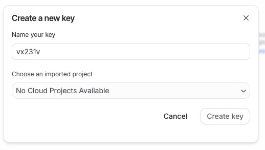
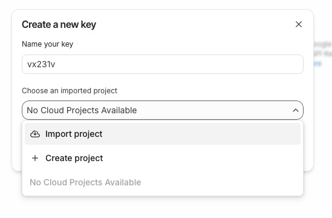
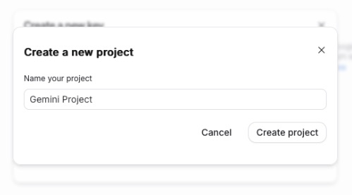
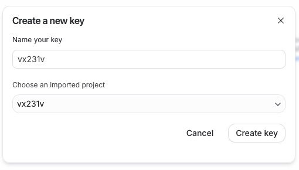
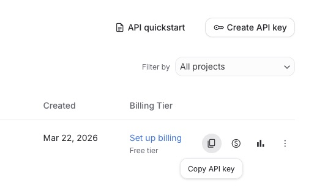

# Gemini API Key anlegen

Um im Statusreport eine KI-gestützte Analyse der DSL-Daten und des Routerlogs durchführen zu können, wird ein **kostenloser API-Key** von Google Gemini benötigt. Dieser Schlüssel wird während des Terminal-Setups erfragt und in der `config.ini` gespeichert.

!!! warning "WICHTIGER DISCLAIMER"
    Google behält sich in den Nutzungsbedingungen des Free Tiers das Recht vor, die über die API gesendeten Eingabedaten (Prompts) aufzuzeichnen. Diese Protokolle können von menschlichen Google-Mitarbeitern gelesen und für das Training zukünftiger Google-KI-Modelle verwendet werden.


Der unter [Setup & Installation: AI-Analyse](../setup.md#option-2-manuelle-einrichtung-und-konfiguration) beschriebene Weg, am Mac einen AI Shortcut mit höherer Privacy zu nutzen, funktioniert weiterhin!

## Schritt 1: Google AI Studio öffnen
Wenn das Skript auf einem Rechner mit GUI Oberfläche ausgeführt wird, wird das *Google AI Studio* automatisch während der Installation vom Skript im Browser geöffnet.<br>
Andernfalls das *Google AI Studio* unter [aistudio.google.com/app/apikey](https://aistudio.google.com/app/apikey) im Browser öffnen und mit einem regulären Google-Konto einloggen.

Nach dem Login auf der Studio Startseite rechts oben auf den Button **Create API key** klicken.



## Schritt 2: API Key benennen
Es öffnet sich ein neues Konfigurationsfenster. 
Im oberen Textfeld einen aussagekräftigen Namen für den API-Schlüssel eintragen (z. B. `RouterReport` oder `vx231v`), um diesen später zuordnen zu können. 
Anschließend unten das Auswahlmenü („Search or create project“) öffnen.



## Schritt 3: Neues Projekt erstellen
In der ausgeklappten Liste den Punkt **Create project** auswählen. Dadurch wird im Hintergrund automatisch ein passendes, kostenloses Google Cloud-Projekt für den API-Zugriff eingerichtet.



## Schritt 4: Projektname vergeben
In dem sich nun öffnenden Eingabefeld einen Namen für das neue Projekt eintragen (z. B. `Router-AI` oder nochmal `vx231v`) und die Eingabe durch einen Klick auf **Create project** bestätigen.



## Schritt 5: Key-Generierung abschließen
Nachdem das Projekt erstellt und ausgewählt wurde, wird der Button rechts unten aktiv. Final auf **Create API key** klicken.



## Schritt 6: API Key kopieren
Der Google Gemini API Key wurde erfolgreich generiert. 
Oben rechts auf **Copy** klicken, um den Key (welcher mit `AIza...` beginnt) in die Zwischenablage zu übernehmen.



---

## Schritt 7: API Key in das Skript übernehmen
Den kopierten Key nun in die wartende Kommandozeile des Terminal-Fensters einfügen (beim Skript `setup_ai_key.sh` oder `install.sh`).

Der eingefügte Key wird auf Gültigkeit geprüft und anschließend in der `config.ini` gespeichert.

Sollte der Testaufruf fehlschlagen, weil der API-Key ungültig ist, beginnt des Skript erneut mit der Aufforderung zur Eingabe des API-Keys.

## AI Modul aktivieren/deaktivieren
Ob das AI Modul im Statusreport genutzt wird, kann jederzeit durch Ändern des Abschnittsnamens in der config.ini gesteuert werden.

Standardmäßig ist das AI Modul nach Eingabe eines gültigen Keys aktiviert.<br>

```config.ini
[AI] # AI = Modul aktiviert noAI = Modul deaktiviert
ai_provider = gemini
ai_api_key = AIza …
```

Um es zu deaktivieren, muss der Abschnittsname  in der config.ini von `[AI]` in `[noAI]` geändert werden, bzw. um es wieder zu reaktivieren, muss der Abschnittsname von `[noAI]` in `[AI]` geändert werden.