# Statusreport

Der Statusreport fasst die vom Router gesammelten Daten in einem HTML-Dokument zusammen. Das Dokument kann direkt im Browser geöffnet oder automatisiert per E-Mail versendet werden.

<details>
<summary>Vollständiger Statusreport</summary>

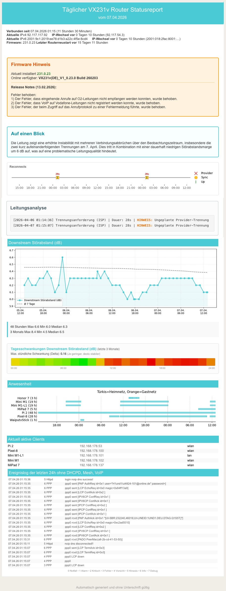

</details>

## Report-Aufruf im Terminal
Der Report wird mit `tp-report.py` generiert:

```bash
# Report erstellen und im Browser öffnen
python3 tp-report.py --show

# Report erstellen und per E-Mail versenden
python3 tp-report.py --send

# Report auf Englisch ausgeben
python3 tp-report.py --show --en
```

## Report-Sprache beim Aufruf auswählen
Die Sprache des Reports wird über den Abschnitt `[Language]` gesteuert:

```ini
[Language]
lang = de    # de = Deutsch, en = Englisch
```

Alternativ lässt sich die Sprache auch per Kommandozeilenargument (`--de` / `--en`) für eine einzelne Ausführung setzen; der Wert wird dabei dauerhaft in der `config-report.ini` gespeichert.

## Modulauswahl
Einzelne Module des Reports lassen sich individuell über die `config-report.ini` aktivieren oder deaktivieren.<br>
`True` = Modul wird angezeigt, `False` = Modul wird nicht angezeigt:

```ini
[Modul]
ai_analysis      = True   # KI-Analyse (Auf einen Blick)
reconnects       = True   # Reconnect-Zeitstrahl
line_analysis    = True   # Erweiterte Leitungsanalyse
downstream_chart = True   # DSL-Parameterchart
snr_heatmap      = True   # Tagesschwankungen-Heatmap
client_presence  = True   # Anwesenheits-Ganttchart
presence         = True   # Aktuell aktive Clients
event_log        = True   # Ereignislog
```

---

## Header

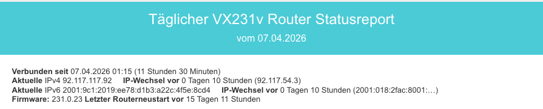

Der Header wird bei jeder Reporterstellung aus den aktuellen Datenbank-Werten befüllt und zeigt:

- Datum und Uhrzeit der aktuellen Verbindung seit letztem PPP-Connect (`PAP AuthAck`)
- Aktuelle IPv4- und IPv6-Adresse inkl. Zeitpunkt des letzten IP-Wechsels
- Installierte Firmware-Version und Zeit seit dem letzten Routerneustart

---

## Firmware-Hinweis

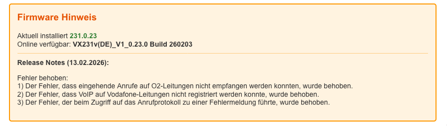

Dieser Abschnitt erscheint **nur**, wenn eine neuere Firmware als die aktuell installierte auf der TP-Link-Supportseite verfügbar ist. Das Skript ruft dazu die TP-Link-Downloadseite für den Router (aktuell: VX231v ab und vergleicht die dort hinterlegte Versionsnummer mit der in der Datenbank gespeicherten Firmware-Version.

Ist ein Update verfügbar, werden angezeigt:
- Aktuell installierte Version
- Verfügbare Online-Version
- Veröffentlichungsdatum
- Release Notes (werden direkt von der TP-Link-Seite geladen und unverändert ausgegeben)

> **Hinweis:** TP-Link stellt die Release Notes nicht in strukturierter Form bereit. Die Darstellung kann sich von Version zu Version unterscheiden.

---

## Auf einen Blick – KI-Analyse

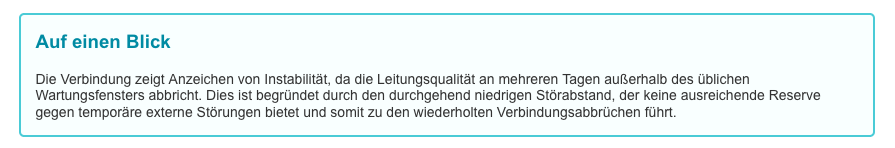

Aktiviert durch `ai_analysis = True` im Abschnitt `[Modul]`.

Das Modul sendet die Routerdaten der letzten Stunden (identisch mit dem gewählten Zeitraum desEreignislogs) an eine KI-API und gibt die Bewertung im Report aus. Unterstützt werden dabei zwei Provider:

```ini
[AI]
ai_provider = gemini
ai_api_key  = DEIN_API_KEY
```

- **`gemini`**: Direkte Anbindung an die Google Gemini API. Hierfür ist ein kostenloser API-Key aus dem Google AI Studio erforderlich, das Script ruft auf Wunsch direkt die entsprechende Google Seite auf, um den API-Key zu erhalten.

> [!NOTE]
> Schritt für Schritt Anleitung: [Wie man einen kostenlosen Gemini API Key erhält](gemini_api_key.md)

Das KI-Modul wird durch **Umbenennen** des Abschnitts in `[noAI]` dauerhaft deaktiviert – kein Löschen des API-Keys erforderlich. Alternativ kann man auch das ganze Modul durch `ai_analysis = False` deaktivieren.

Sind die Routerdaten zu umfangreich für eine API-Anfrage oder erhält das Skript aus anderem Grund keine Serverantwort, legt es den generierten Prompt als `ai_prompt_debug.txt` im Skriptordner ab.<br>
Diese Datei kann dann zur Analyse manuell in eine beliebige KI eingefügt werden.

---

## Reconnects – Verbindungszeitstrahl

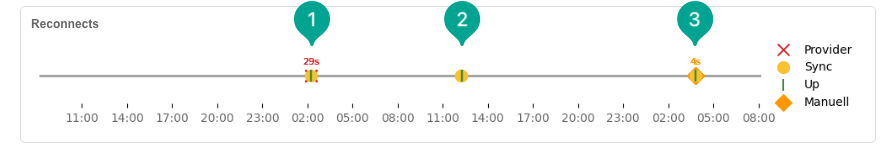

Aktiviert durch `reconnects = True` im Abschnitt `[Modul]`.

Der Zeitstrahl visualisiert Verbindungsereignisse der letzten Tage (der Zeitraum wird über `[Charts] hours_back` festgelegt). Drei Ereignistypen werden unterschieden:

| Symbol | Farbe | Bedeutung |
|--------|-------|-----------|
| ✕ | Rot | Provider-Trennung (`LCP down`) |
| ● | Orange | DSL-Synchronisationsverlust |
| \| | Grau | Verbindungswiederherstellung |

Oberhalb der Symbole wird die Dauer des jeweiligen Verbindungsausfalls in Sekunden angezeigt. Dauert der Reconnect ungewöhnlich lange, wird dies in der Leitungsanalyse genauer untersucht.

---

## Leitungsanalyse - regelbasiert

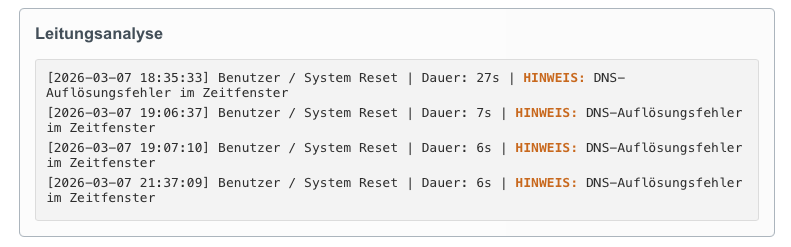

Aktiviert durch `line_analysis = True` im Abschnitt `[Modul]`.

Die Leitungsanalyse korreliert die abstrakten PPPoE-Trennungsereignisse aus der `events`-Tabelle mit den physikalischen DSL-Werten aus der `dsl`-Tabelle. Ausgegeben werden nur Ereignisse ab einem konfigurierten Schweregrad:

```ini
[Analyse]
report_disconnects_level = 1   # 1 = Alarm, 2 = Kritisch, 3 = Fehler
```

Für jede Trennung klassifiziert das Skript den Auslöser und prüft drei Warnbedingungen:

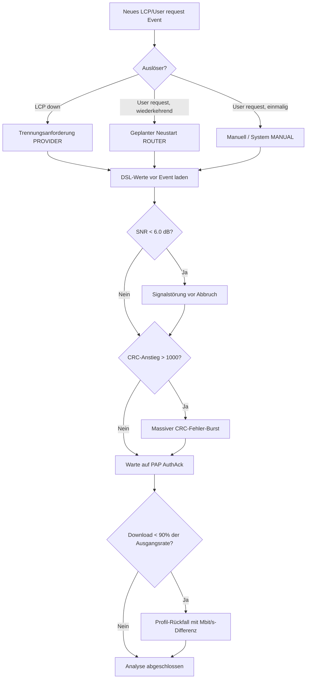

Die drei Warn-Checks im Detail:

1. **SNR-Signalstörung** – Sinkt der Downstream Noise Margin (SNR, aus Tabelle `dsl`, Feld `downstream_noise_margin`) unmittelbar vor einem Abbruch auf unter 6,0 dB, deutet dies auf eine physikalische Leitungsstörung hin.
2. **CRC-Fehler-Burst** – Steigen die Download-CRC-Fehler im Vergleich zur vorletzten Aufzeichnung um mehr als 1.000 an, wird ein massiver Fehlerbursts signalisiert (z. B. Wackelkontakt, fehlende Schirmung).
3. **Profil-Rückfall** – Verbindet sich der Router nach einem Disconnect mit weniger als 90 % der vorherigen Sync-Rate, wird der Bandbreitenverlust in Mbit/s ausgewiesen.

Zusätzlich meldet das Modul:
- **PADO-Timeouts**: Treten mehr als 10 Discovery-Timeouts im Auswertungszeitraum auf, wird eine schwere Provider-seitige Discovery-Störung gemeldet (Hinweis auf IPv6/RFC 4638-Problem).
- **DNS-Fehler im Zeitfenster**: DNS-Auflösungsfehler aus dem `Httpd`-Log werden mit dem Trennungszeitraum korreliert.
- **Verzögerter Reconnect**: Dauert die Wiederherstellung einer Verbindung mehr als 45 Sekunden, wird auf einen möglichen Sync-Verlust hingewiesen.

---

## Downstream Störabstand -Parameterchart

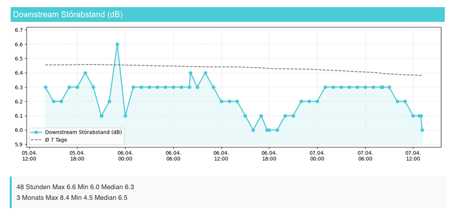

Aktiviert durch `downstream_chart = True` im Abschnitt `[Modul]`.

Der Chart zeigt den Verlauf eines frei konfigurierbaren DSL-Parameters über den gewählten Zeitraum. Standardmäßig wird der Downstream Noise Margin (Störabstand) dargestellt.<br>
Zum leichteren Entdecken von Verschlechterungstendenzen wird zusätzlich zu den gemessen Werten ein gleitender Durchschnitt der letzten 7 Tage eingeblendet.

```ini
[Charts]
hours_back         = 48    # Zeitraum in Stunden
start_hour         = 0     # Startstunde (0 = Mitternacht)

table_1            = dsl                      # Quelltabelle (SQLite)
field_1            = downstream_noise_margin  # Datenbankfeld
label_1            = SNR Downstream (dB)      # Beschriftung im Report
moving_average_days = 7                       # Tage für gleitenden Ø
```

Es lassen sich bis zu vier Charts parallel konfigurieren (`table_1`/`field_1`/`label_1` bis `table_4`/`field_4`/`label_4`). Jeder Chart, für den `table_x` und `field_x` gesetzt sind, wird automatisch in den Report aufgenommen.

Unterhalb des ersten Charts werden statistische Kennzahlen ausgegeben:
- Maximum, Minimum und Median für den eingestellten Auswertungszeitraum
- Maximum, Minimum und Median der letzten 3 Monate

Wer zur Diagnose grafische Darstellungen über einen längeren Zeitraum benötigt, kann sich diese mit dem Skript `vx-info.py`  und dem Parameter `--dashboard` erstellen lassen, das stellt zur interaktiven Anzeige historischer Metriken einen lokalen Webserver bereit. Weitere Informationen zum [VX-Info Tracker](https://github.com/einstweilen/tp-link-vx231v/blob/main/vx-info.md).

---

## Tagesschwankungen – SNR-Heatmap

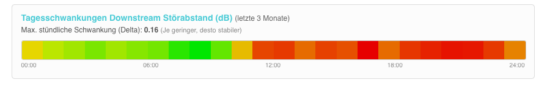

Aktiviert durch `snr_heatmap = True` im Abschnitt `[Modul]`.

Die Heatmap visualisiert die täglichen Schwankungen des konfigurierten DSL-Parameters (standardmäßig `SNR Downstream`) über die letzten 3 Monate. Für jede Stunde des Tages (0–24 Uhr) wird der Durchschnittswert berechnet; aus Maximum und Minimum dieser stündlichen Mittelwerte ergibt sich das Delta.

Das Farbspektrum reicht von Grün (gering, stabil) über Gelb bis Rot (hohe Schwankung). Die Heatmap hilft dabei, tageszeit-abhängige Instabilitäten der DSL-Verbindung zu erkennen.

Der in der Heatmap angezeigte Parameter ist der gleiche, wie der unter `[Charts]` (`table_1` / `field_1`) definierte.

---

## Anwesenheitschart

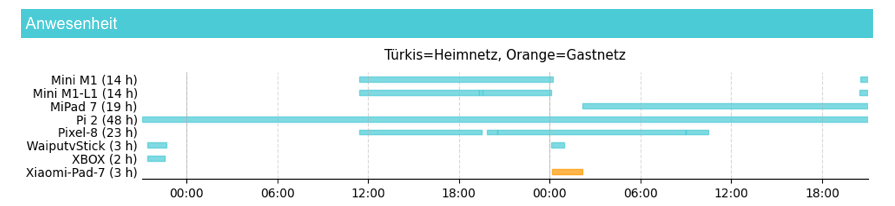

Aktiviert durch `client_presence = True` im Abschnitt `[Modul]`.

Zeigt die WLAN- und LAN-Verbindungszeiträume aller Clients für den eingestellten Zeitraum.<br>
Die Farbgebung unterscheidet:

- **Türkis**: Heimnetz-Verbindung
- **Orange**: Gastnetz-Verbindung

Die Zuordnung zum Heimnetz oder Gastnetz wird durch Korrelation der DHCP-`DISCOVER`/`OFFER`-Events aus dem Router-Log mit den IP-Adressen ermittelt. Dabei wird das Subnetz der Router-IP (`router_ip` in `[Router]`) als Heimnetz-Referenz verwendet.

In Klammern hinter jedem Clientname steht die Aktivitätszeit in Stunden im eingestellten Zeitraum.

---

## Aktuell aktive Clients

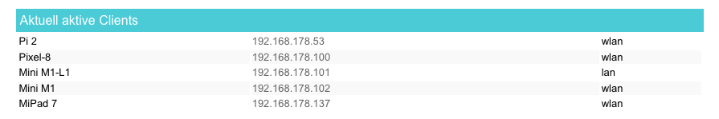

Aktiviert durch `presence = True` im Abschnitt `[Modul]`.

Die Tabelle listet alle zum Zeitpunkt der Reporterstellung im Netzwerk aktiven Geräte mit Hostname, IP-Adresse und Verbindungstyp (WLAN / LAN) auf. Als „aktiv" gilt ein Client, wenn entweder:

- eine offene Session in den DHCP-Log-Auswertungen vorliegt (letzte Aktivität < 5 Minuten zurück), oder
- der Client beim letzten Update als verbunden markiert war.
Bei der Generierung des Statusreports wird die Liste der aktiven Clients aktualisiert.

---

## Ereignislog

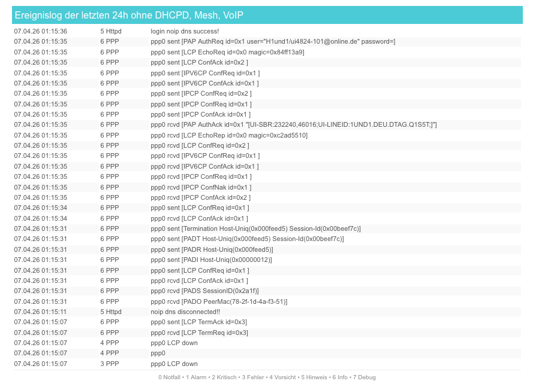

Aktiviert durch `event_log = True` im Abschnitt `[Modul]`.

Das Ereignislog zeigt die Router-Events des konfigurierten Zeitraums tabellarisch an (Timestamp, Level, Typ, Meldungstext). Der angezeigte Zeitraum und die Filterung werden über den Abschnitt `[Events]` gesteuert:

```ini
[Events]
hours_back    = 24          # Zeitraum des Logs in Stunden
start_hour    = 0           # Startstunde

show_level    = 4           # Maximaler Loglevel (inklusiv)
exclude_types = Mesh, DHCPD, VoIP  # Ausgeschlossene Event-Typen (bei Level 9)
```

Da der reine Verwaltungstraffic des Routers i.d.R. nicht relevant für eine Verbindungsproblemanalyse ist, kann man die Events der `exclude_types` im Report ausblenden.

Um ein übermäßges Anwachsen der Datenbank zu verhindern, können über den Parameter `cleanup_excludes` alle Events der Typen `exclude_types`, die älter als X Tage sind, aus der Datenbank gelöscht werden.<br>
Durch `cleanup_excludes = 0` werden keine Events zeitgesteuert gelöscht.

### Loglevel

Der Router vergibt für jeden Eintrag einen Schweregrad von 0 bis 7:

```
0 Notfall   1 Alarm    2 Kritisch  3 Fehler
4 Vorsicht  5 Hinweis  6 Info      7 Debug
```

`show_level = 4` zeigt alle Einträge bis einschließlich Level 4 (Vorsicht). `show_level = 7` zeigt alle Einträge.

### virtueller Loglevel 9 - Gefiltertes Volllog

`show_level = 9` ist ein virtueller Loglevel: Er zeigt alle Einträge (wie Level 7 'Debug'), blendet aber die unter `exclude_types` eingetragenen Event-Typen aus. Dies ist besonders nützlich, da `DHCPD`- und `MESH`-Events durch das ständige An- und Abmelden von Clients sehr umfangreich werden können.

Die Header-Zeile des Logs zeigt an, welche Typen ausgeblendet wurden.

Beispiel für einen Log-Eintrag:

```
Datum               Level  Typ    Event
07.04.26 01:15:07    3     PPP    ppp0 LCP down
```

---

## Alte Reports aufräumen

Generierte HTML-Berichte werden im Unterordner `reports/` abgelegt. Über den Parameter `cleanup_reports` werden automatisch ältere Dateien gelöscht:

```ini
[Reports]
cleanup_reports = 7   # Reports älter als 7 Tage werden gelöscht (0 = deaktiviert)
```

---

## Vollständige `config-report.ini` – Übersicht

```ini
[Router]
# IP des TP-Link Routers
# passwort ist das Passwort der Router-Admin-Oberfläche
router_ip        = 192.168.0.1
password         = DEIN_ROUTER_PASSWORT

[Database]
# SQLite Datenbank kompatibel zu vx-info.py
# Beide Skripte können dieselbe Datenbank nutzen
# dazu in beiden configs den gleichen Pfad angeben
db_name          = router_data.db

[Email]
# SMTP Server und Zugangsdaten des Providers
# man kann sich einen eigenen Account nur für das Reportversenden und -empfangen einrichten
# dann sind die Zugangsdaten völlig unabhängig vom Haupt-E-Mail-Account
smtp_server      = smtp.example.com
smtp_port        = 587
sender_email     = sender@example.com
sender_password  = PASSWORD
recipient_email  = recipient@example.com

[Modul]
# True das Modul ist aktiviert / False das Modul ist deaktiviert
ai_analysis      = True 
reconnects       = True
line_analysis    = True
downstream_chart = True
client_presence  = True
presence         = True
snr_heatmap      = True
event_log        = True

[AI]
# diese Daten werden vom Setupskript eingetragen
ai_provider = gemini
ai_api_key  = DEIN_GEMINI_API_KEY

[Analyse]
# regelbasierte Analyse der Routerevent-Logs
report_disconnects_level = 1

[Charts]
# Verlaufsdiagramm erfaßter DSL-Daten
# die Feldnamen kann man im Skript unter
# class DatabaseManager => def _create_tables einsehen
hours_back       = 48
start_hour       = 0
table_1          = dsl
field_1          = downstream_noise_margin
label_1          = SNR Downstream (dB)
moving_average_days = 7

[Events]
# Zeitraum für das Routereventlog und die AI Analyse
hours_back = 24      # Zeitraum der Events in Stunden gemessen vom Zeitpunkt der Reportgenerierung
start_hour = 0       # Startstunde der Events (0 = Mitternacht)

# Ausgeschlossene Event-Typen für das Log und die Analyse
exclude_types = Mesh, DHCPD, VoIP

# Log Level Filter: 0 Notfall   1 Alarm    2 Kritisch  3 Fehler 
#                   4 Vorsicht  5 Hinweis  6 Info      7 Debug (zeigt alles)
#                   9 zeigt alles wie 7 Debug aber filtert die 'exclude_types' aus
show_level = 4      # bis einschließlich dieses Levels anzeigen

cleanup_excludes = 3 # Tage bis alte Events vom Typ 'exclude_types' aus der Datenbank gelöscht werden

[Reports]
# Alte Tagesreports löschen (0 = deaktiviert)
cleanup_reports  = 7

[Language]
# Ausgabesprache des Tagesreports
# de = Deutsch, en = Englisch
lang = de 
```
